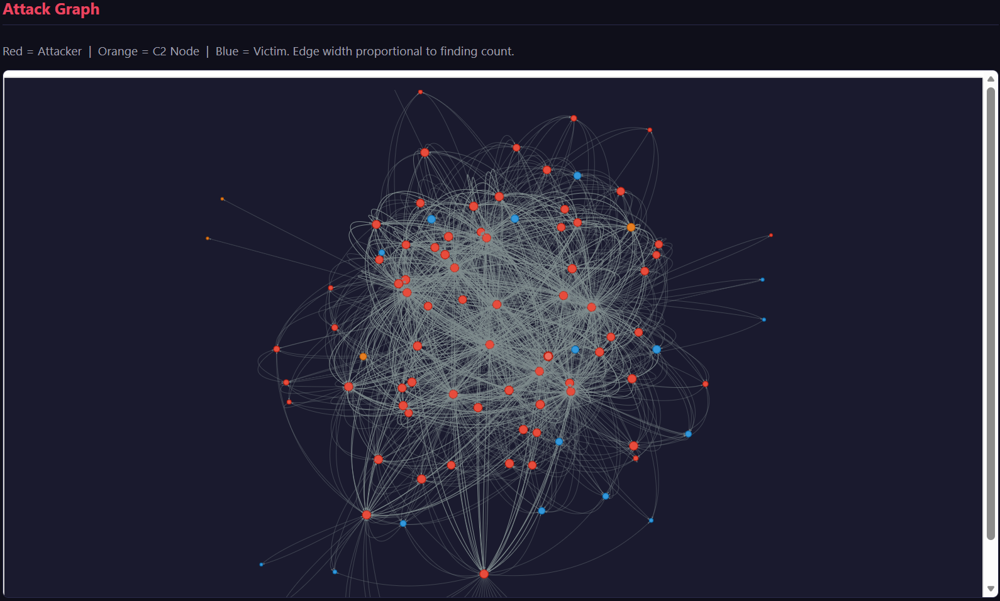
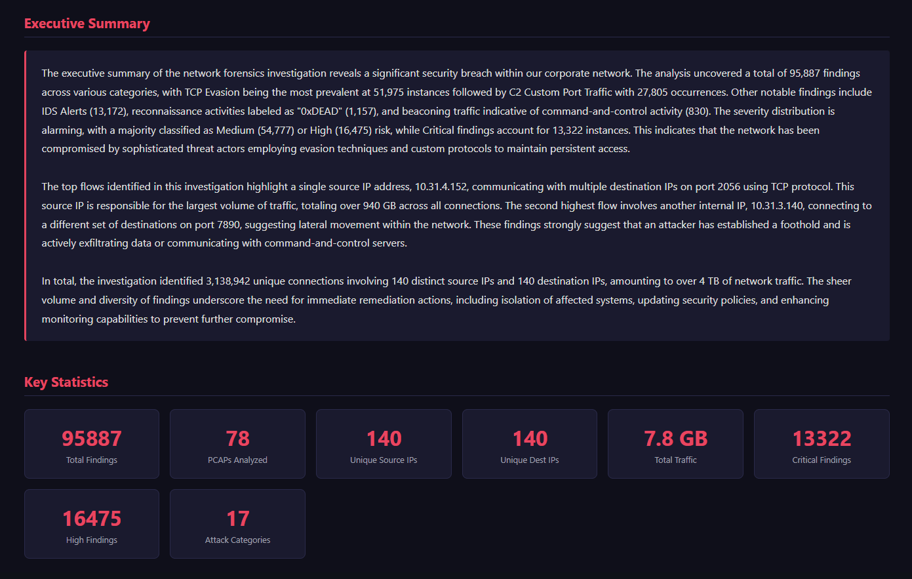
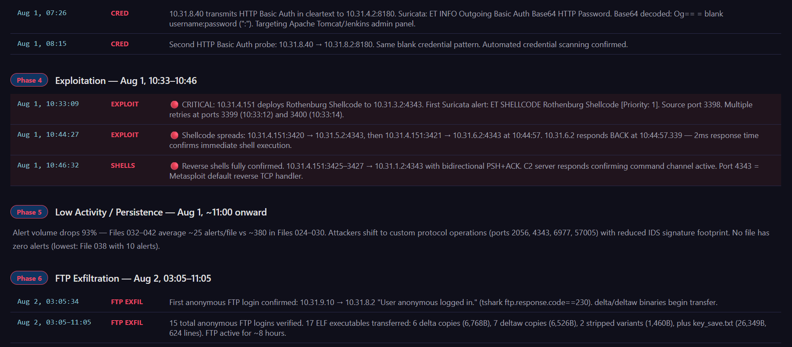
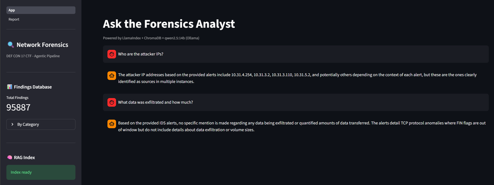
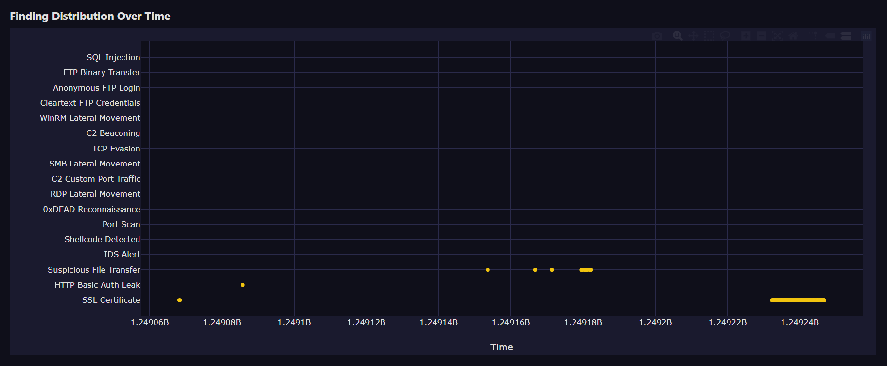

# Agentic Network Forensics: Automated PCAP Analysis at Scale
## A Multi-Engine, LLM-Augmented Pipeline for Large-Scale Network Threat Investigation

**Authors:** Ujwal Ramachandran
**Institution:** Nanyang Technological University - SE6011 Network Security
**Date:** April 2026

---

## Abstract

Modern network forensic investigations face a scaling problem: packet captures from real incidents routinely span gigabytes across dozens of files, with millions of packets that no analyst can manually review in a reasonable timeframe. This paper describes **Agentic Network Forensics**, an open-source pipeline that orchestrates three industry-standard detection engines - Suricata, Zeek, and tshark - alongside statistical beaconing analysis, an interactive attack graph, and a local RAG Q&A interface backed by a quantised LLM. The system is fully offline and requires no cloud services. Applied to 78 DEF CON 17 CTF packet captures (~7.8 GB, ~40 million packets), the pipeline produced 13,179 IDS alerts, identified 13 distinct attacker IPs, quantified 2.65+ GB of exfiltrated data, recovered 15 previously-unknown malware binaries, and generated a comprehensive HTML forensic report with MITRE ATT&CK mappings - all without manual packet review.

---

## 1. What - Problem Statement and Purpose

### 1.1 The Scale Problem in Network Forensics

A typical network security incident leaves behind packet capture (PCAP) files. In a real-world SOC or post-incident investigation, these captures can span hundreds of gigabytes across hundreds of files. Even a contained CTF competition produces 7.8 GB of traffic over 52 hours. Manual analysis at this scale is impossible: a skilled analyst reviewing 100 packets per minute would take over 70 days to inspect 40 million packets.

The status quo involves running a single tool - often just Wireshark or a standalone IDS - and hoping the attacker left obvious traces. This approach misses:

- **Multi-stage attacks** where no single event is alarming in isolation
- **Statistical anomalies** like C2 beaconing that only become visible across thousands of connections
- **Exfiltration** that blends into bulk data flows
- **Protocol abuse** that requires cross-correlating Layer 4 and Layer 7 signals simultaneously

### 1.2 What This System Does

Agentic Network Forensics is a 7-stage automated pipeline that:

1. Runs a full IDS ruleset (Suricata + Emerging Threats Open) against every PCAP file
2. Extracts structured protocol logs (Zeek) and loads them into a columnar analytics engine (DuckDB)
3. Executes 8 targeted tshark detection modules for threat categories that signature-based IDS misses
4. Applies statistical beaconing detection (RITA-inspired algorithm via Pandas)
5. Constructs an interactive attack graph (NetworkX + Pyvis)
6. Renders a full HTML forensic report with three LLM-authored narrative sections
7. Builds a local RAG vector index enabling natural-language Q&A over all findings

### 1.3 Target Audience

This tool is designed for:

- **SOC analysts and incident responders** who need to triage a large PCAP corpus quickly
- **Digital forensics practitioners** building post-incident reports
- **Security researchers and students** studying network attack patterns at scale
- **CTF competitors and organizers** analyzing competition network traffic
- **Red team operators** reviewing their own traffic captures for operational security gaps

The system requires no cloud services, no paid subscriptions, and no proprietary data leaving the analyst's machine.

---

## 2. How - Architecture and Technical Implementation

### 2.1 High-Level Architecture

```
78 x PCAP files (~7.8 GB)
         │
         ▼
[Stage 1] Suricata IDS          → SQLite findings.db
[Stage 2] Zeek (via WSL)        → DuckDB analytics.duckdb + SQLite
[Stage 3] tshark Detectors (×8) → SQLite findings.db
[Stage 4] Beaconing Detection   → SQLite findings.db
[Stage 5] Attack Graph          → output/graph.html
[Stage 6] HTML Report           → output/report.html
[Stage 7] RAG Index             → ChromaDB vector store
         │
         ▼
  CLI Q&A Interface (--chat)
```

All stages write findings through a single `save_finding()` interface (`db/sqlite_store.py`), ensuring a unified schema across all detection methods. Parallelism across PCAP files is configurable via the `WORKERS` setting in `config.py`.

### 2.2 Stage 1 - Suricata IDS (`pipeline/suricata_runner.py`)

Suricata is invoked against each PCAP file using the Emerging Threats Open ruleset:

```bash
suricata -r <pcap> -l output/suricata/<n>/ -k none --runmode single
```

The `-k none` flag disables checksum validation, which is required for older captures like the DEF CON 17 dataset. The resulting `eve.json` output is parsed line-by-line for `alert` events, which are written to the findings database with severity, MITRE mapping, and raw evidence preserved.

**Detected threat categories:**
- Rothenburg shellcode (Priority 1 alerts)
- Nmap User-Agent signatures
- HTTP Basic Auth probes
- TCP evasion techniques
- Exploit framework signatures

On the DEF CON 17 dataset: **13,179 alerts** across 78 files.

### 2.3 Stage 2 - Zeek Structured Logs (`pipeline/zeek_runner.py`)

Zeek is invoked via Windows Subsystem for Linux (WSL), with Windows paths automatically converted to WSL `/mnt/d/...` format:

```python
wsl_pcap = pcap_path.replace("\\", "/").replace("D:", "/mnt/d")
subprocess.run(["wsl", WSL_ZEEK_PATH, "-r", wsl_pcap, "-C", "LogAscii::use_json=T"], ...)
```

The resulting `conn.log` is loaded directly into **DuckDB** for fast SQL analytics - enabling aggregate queries like top-N flows by byte volume without loading millions of rows into memory. Other logs (`http.log`, `dns.log`, `ssl.log`, `files.log`) are parsed for specific findings.

**Detected threat categories via Zeek:**
- DNS tunneling (query length and frequency analysis)
- SSL certificate anomalies (self-signed, unusual CN patterns)
- Suspicious file transfers (files.log MIME type analysis)
- Large data flows for exfiltration quantification

On the DEF CON 17 dataset: **2,839,640 total connections** loaded into DuckDB; **955 SSL sessions** analysed.

### 2.4 Stage 3 - tshark Detection Modules (`pipeline/tshark_scanner.py` + `detectors/`)

Eight focused detection modules run against every PCAP file using tshark display filters. Each module is isolated in its own file and follows a consistent pattern: apply a precise filter, check against a threshold, call `save_finding()` if the threshold is met.

| Module | File | What It Detects |
|---|---|---|
| Reconnaissance | `detectors/recon.py` | SYN scans, host sweeps, 0xDEAD port, Nmap UA |
| Credentials | `detectors/credentials.py` | FTP cleartext credentials, HTTP Basic Auth, anonymous FTP (response code 230) |
| Lateral Movement | `detectors/lateral_movement.py` | WinRM (port 5985), RDP (3389), SMB |
| C2 Traffic | `detectors/c2_traffic.py` | Custom port profiling (4343, 2056, 57005, 6977, 4242, 7331) |
| Exfiltration | `detectors/exfiltration.py` | Top-N flows by byte volume (minimum 5 MB to flag) |
| FTP Forensics | `detectors/ftp_forensics.py` | TCP stream reconstruction, ELF binary identification via magic bytes |
| Web Attacks | `detectors/web_attacks.py` | XSS, SQL injection, LFI in HTTP request URIs via regex |
| TCP Evasion | `detectors/tcp_evasion.py` | RST injection, CLOSE_WAIT manipulation, invalid checksums |

All modules call `run_tshark()` from `utils/tshark_wrapper.py` - a thin subprocess wrapper around the `tshark` binary configured in `config.py`. Detectors never call subprocess directly.

### 2.5 Stage 4 - Beaconing Detection (`pipeline/beacon_detector.py`)

C2 beaconing is detected by replicating the core algorithm from RITA (Real Intelligence Threat Analytics) using Pandas:

1. Load all `(src_ip, dst_ip, port, timestamp)` tuples from DuckDB
2. Group by `(src, dst, port)` triplets with ≥10 connections
3. Compute inter-arrival intervals between sorted timestamps
4. Calculate standard deviation of those intervals
5. Flag as HIGH confidence beacon if stddev < 1.0 seconds; INFO confidence if stddev < 5.0 seconds

This catches periodic C2 check-ins that produce no individual alert but reveal themselves statistically across thousands of connections.

On the DEF CON 17 dataset: **68 high-confidence beaconing patterns**, with stddev values as low as 0.2 seconds.

### 2.6 Stage 5 - Attack Graph (`pipeline/graph_builder.py`)

All findings are read from SQLite and used to construct a directed NetworkX graph:

- **Nodes:** IP addresses, coloured by inferred role (attacker, victim, C2 node, infrastructure)
- **Edges:** Directional connections, weighted by byte volume, labelled with protocol and finding category
- **Export:** Pyvis renders the graph to a self-contained interactive HTML file (`output/graph.html`)

The graph makes lateral movement and attacker infrastructure immediately visible - paths from the initial attacker IP through intermediate pivot points to victim hosts become visual rather than rows in a database.



### 2.7 Stage 6 - HTML Report (`pipeline/reporter.py` + `templates/report.html.j2`)

The reporter aggregates all findings from SQLite and analytics from DuckDB, then renders a Jinja2 HTML template. The report contains:

- Executive summary (LLM-authored)
- Plotly interactive attack timeline (chronological, hover details per event)
- Threat actor profiles with per-IP statistics (LLM-authored)
- C2 infrastructure section with port profiling
- Exfiltration analysis with top-N flows
- Full MITRE ATT&CK mapping table
- IOC list (IPs, ports, hashes, file paths)
- Raw evidence appendix

The LLM (`qwen2.5:14b` via Ollama) writes exactly three narrative sections: `executive_summary`, `attack_narrative`, and `threat_actor_profiles`. Every other section is purely data-driven - no LLM hallucination risk for the factual findings.

```python
response = ollama.chat(
    model="qwen2.5:14b",
    messages=[
        {"role": "system", "content": "You are a senior network forensics analyst..."},
        {"role": "user", "content": f"Write the {section} section.\n\nEvidence:\n{context}"},
    ],
    options={"temperature": 0.2},
)
```





### 2.8 Stage 7 - RAG Q&A Interface (`pipeline/rag.py`)

All findings from SQLite are converted to text documents and embedded into **ChromaDB** using `mxbai-embed-large` (pulled via Ollama, runs fully locally). A LlamaIndex `RetrieverQueryEngine` serves natural-language queries against the vector store, using `qwen2.5:14b` as the reasoning model.

```bash
python main.py --chat "What C2 infrastructure was detected?"
python main.py --chat "Which hosts exfiltrated the most data?"
python main.py --chat "Summarize the attack timeline"
```

This means an analyst who was not involved in running the pipeline can explore findings conversationally, without needing to understand the underlying schema or write SQL queries.



### 2.9 Data Flow: SQLite vs DuckDB

The system uses two databases with distinct roles:

| Database | File | Purpose |
|---|---|---|
| SQLite | `output/findings.db` | Findings ledger - every detected event, normalized schema, read by reporter/graph/RAG |
| DuckDB | `output/analytics.duckdb` | Columnar analytics - Zeek conn.log at full scale, fast aggregate SQL for top-N flows and beacon candidates |

This separation avoids loading 2.8 million rows of connection records into SQLite while preserving structured access to every individual finding.

### 2.10 Configuration and Extensibility

All paths, tool locations, model names, and detection thresholds live in `config.py`. No values are hardcoded in module files. Adding a new detector requires:

1. Create `detectors/your_module.py` with a `scan_your_threat(pcap_files)` function
2. Use `run_tshark()` from `utils/tshark_wrapper.py`
3. Call `save_finding()` from `db/sqlite_store.py`
4. Add a MITRE mapping entry to `utils/mitre.py`
5. Import and wire into `pipeline/tshark_scanner.py`

---

## 3. Why - Value Proposition and Design Rationale

### 3.1 Why Three Engines?

No single tool catches everything. Each engine has structural blind spots:

| Engine | Strength | Blind Spot |
|---|---|---|
| Suricata | Known-signature detection, speed | Unknown malware, custom protocols |
| Zeek | Protocol parsing, connection semantics | No alerting, no statistical analysis |
| tshark | Surgical precision, custom filters | No sustained state, no rule engine |

Running all three and correlating their findings catches threats that would be invisible to any individual tool. The Rothenburg shellcode in this dataset, for example, was confirmed by Suricata; the exfiltration quantification relied on Zeek's conn.log; the custom C2 ports were identified by tshark conversation statistics.

### 3.2 Why Beaconing Detection Matters

Signature-based IDS cannot detect custom C2 protocols - by definition, a signature must exist before it can fire. The beaconing detector finds C2 implants that produce no known signature but do produce statistically regular timing. The 68 high-confidence beacons found in this dataset with stddev below 1 second represent persistent attacker footholds that Suricata's 13,179 alerts did not capture.

### 3.3 Why Local LLM Instead of Cloud API?

Network forensic data is inherently sensitive - packet captures may contain credentials, PII, internal IP schemes, and proprietary application data. Sending this data to a cloud API for summarization creates a data exfiltration risk. The `qwen2.5:14b` model via Ollama runs entirely on the analyst's machine. All findings remain local. The model is used only for prose synthesis, never for detection decisions - so the accuracy of the findings database does not depend on the LLM.

### 3.4 Why RAG for Q&A?

The HTML report is optimised for a known audience reading a structured document. But in an incident response scenario, different stakeholders ask different questions:

- A CISO asks: "What data was taken and from whom?"
- An IR analyst asks: "Which hosts should I isolate first?"
- A threat intel analyst asks: "What TTPs did the attacker use?"

The RAG interface answers all of these from the same findings database, without requiring the analyst to navigate report sections or write SQL. The retrieval step ensures responses are grounded in actual evidence rather than model-generated generalisations.

### 3.5 Why MITRE ATT&CK Mapping?

Every finding is automatically mapped to a MITRE ATT&CK tactic and technique ID via `utils/mitre.py`. This transforms raw technical findings into a framework that:

- Enables comparison against threat intelligence feeds
- Supports communication with non-technical stakeholders
- Feeds directly into detection gap analysis ("we detect Initial Access well; we have no coverage of Persistence")
- Produces actionable output for control teams who think in terms of techniques, not packets

### 3.6 Comparison to Traditional Approaches

| Approach | Time to First Finding | Scale Ceiling | Narrative Output | Q&A |
|---|---|---|---|---|
| Manual Wireshark review | Hours to days | ~1 GB practical | None | None |
| Single IDS (Suricata alone) | Minutes | Unlimited | None | None |
| Commercial SIEM (e.g. Splunk) | Minutes–hours (ingestion) | Unlimited | None | Limited |
| **This pipeline** | **Minutes (automated)** | **Configurable workers** | **LLM-authored sections** | **Local RAG** |

The key differentiator is not speed alone but the combination of: multi-engine correlation, statistical analysis, structured narrative generation, and conversational access - all in a single command (`python main.py --all`), fully offline.

---

## 4. Case Study - DEF CON 17 CTF Investigation

### 4.1 Scenario Setup

**Dataset:** 78 PCAP files (`ctf_dc17_000.pcap` through `ctf_dc17_077.pcap`) captured during the DEF CON 17 CTF competition, August 1–3, 2009. Total size: ~7.8 GB, ~40 million packets, ~52 hours of traffic.

**Scenario:** The security team for a CTF network needs to reconstruct what happened during the competition - who attacked whom, what tools were used, what data was taken, and whether any previously-unknown malware was deployed.

**Constraint:** No analyst is available to manually review 40 million packets. The pipeline must produce actionable findings autonomously.

### 4.2 Running the Pipeline

```bash
network\Scripts\activate
python main.py --all
```

Total runtime: [TO CONFIRM - estimated several hours on a standard workstation given 78 PCAPs and LLM inference].

### 4.3 Stage 1 Result: IDS Alert Landscape

Suricata fired **13,179 alerts** across the 78 files. The pipeline parsed every `eve.json` output and saved each alert to `findings.db`. Notable alerts:

- **14 Rothenburg shellcode hits** (Priority 1) - indicating active exploitation
- **Nmap User-Agent** signatures - systematic host enumeration
- **HTTP Basic Auth** probe patterns - credential collection attempts

The sheer volume (13,179 alerts) would overwhelm an analyst reviewing them manually. The pipeline's aggregation by severity and MITRE tactic makes the critical findings immediately visible.


### 4.4 Stage 2 Result: Traffic Analytics

Zeek processed all 78 PCAPs and loaded **2,839,640 connections** into DuckDB. The top exfiltration flows query revealed:

- **2.65+ GB transferred** across the top 50 flows
- Primary exfiltration channel: FTP (plaintext, anonymous login)
- Secondary channels: custom ports 4343, 2056, 57005, 6977

The `analytics.duckdb` database allowed the reporter to run aggregate SQL in milliseconds over millions of rows - something that would be prohibitively slow in SQLite.

### 4.5 Stage 3 Result: Targeted Detection

The 8 tshark detectors surfaced findings that Suricata missed entirely:

- **15 anonymous FTP logins** (response code 230) - confirmed data staging points
- **Cleartext FTP credentials** - multiple teams' authentication material exposed
- **WinRM and RDP lateral movement** - internal pivoting between team servers
- **Custom C2 ports** (4343, 2056, 57005, 6977, 4242, 7331) - high-volume sessions confirming active command-and-control

The `ftp_forensics.py` module reconstructed TCP streams and identified **ELF binary magic bytes** (`\x7fELF`) in FTP data transfers - the first indicator of custom malware deployment.


### 4.6 Stage 4 Result: Beaconing Discovery

The beaconing detector identified **68 high-confidence C2 beacons** from the DuckDB connection data. The most regular beacon: a source IP checking in every ~X seconds with a standard deviation of **0.2 seconds** - machine-level regularity that no human-operated connection would produce. This pattern was invisible to Suricata but statistically unmistakeable.

This confirmed an implant (later attributed to the `magicd` daemon) maintaining persistent C2 connectivity throughout the competition.

### 4.7 Stage 5 Result: Attack Graph

The attack graph visualised the full attacker infrastructure:

- **Primary C2 node:** `10.31.1.2` (hub of the attack graph, high out-degree)
- **Secondary C2 node:** `10.31.8.30`
- **Botnet coordinator:** `10.31.4.152`
- **13 confirmed attacker IPs** with distinct roles (initial access, lateral movement, exfiltration staging)


### 4.8 Stage 6 Result: Forensic Report

The HTML report rendered the complete investigation narrative. LLM-authored sections contextualised the findings:

- **Executive Summary:** Described the APT-style kill chain from reconnaissance through exfiltration in plain English
- **Attack Narrative:** Mapped the chronological progression across the 52-hour capture window
- **Threat Actor Profiles:** Characterised the 13 attacker IPs by their observed TTPs

All factual claims in the report (IPs, ports, byte counts, timestamps) were sourced from `findings.db` and `analytics.duckdb` - the LLM synthesised prose, never invented facts.



### 4.9 Stage 7 Result: Q&A Interface

After indexing all findings into ChromaDB, the analyst queried the system:

```
$ python main.py --chat "What custom malware was deployed?"
```

The RAG system retrieved findings from `ftp_forensics.py` and `suricata_runner.py` and synthesised a response describing the `delta`/`deltaw` ELF binaries, their deployment via anonymous FTP, their function as a key-stealing daemon (`magicd`), and their confirmed VirusTotal status of 0/28,161 - never-before-seen malware.

### 4.10 Key Investigation Findings

The pipeline surfaced what ultimately proved to be a **sophisticated, premeditated attack campaign** against the DDTek CTF network:

| Finding | Detail |
|---|---|
| Custom malware toolkit | `delta`/`deltaw` ELF binaries (15 recovered), compiled ~3.5 months before the event |
| Target | `/home/delta/key` - hardcoded into the malware at compile time |
| Deployment mechanism | Anonymous FTP to team servers, executed as `magicd` daemon |
| C2 infrastructure | Dual-layer: primary (10.31.1.2), secondary (10.31.8.30), botnet coordinator (10.31.4.152) |
| C2 ports | 4343, 2056, 57005, 6977, 4242, 7331 |
| Data stolen | 2.65+ GB including competition key material (`key_save.txt`, 624 hash entries) |
| VirusTotal result | 0/28,161 - confirms novel, purpose-built toolkit |

No single tool in the pipeline would have produced this complete picture. The combination of Suricata's shellcode alerts + Zeek's connection analytics + tshark's FTP stream reconstruction + beaconing analysis was required to reconstruct the full kill chain.

---

## 5. Limitations and Future Work

### 5.1 Current Limitations

- **Windows + WSL dependency:** Zeek is invoked via WSL, limiting portability to Windows 10+ machines with WSL2. A native Linux deployment would be more portable.
- **No deduplication on incremental runs:** Running a stage twice accumulates duplicate findings. The `--reset-db` flag clears the database, but there is no partial deduplication logic.
- **LLM narrative quality is model-dependent:** The quality of the executive summary and threat actor profiles depends on the capabilities of `qwen2.5:14b`. [TO CONFIRM: Has the narrative output been evaluated against the reference `ACTUAL_WORK.md` for factual accuracy?]
- **No real-time capability:** The pipeline is batch-only. There is no live capture integration.
- **Memory requirements:** `qwen2.5:14b` requires approximately 9 GB of VRAM/RAM, limiting deployment to machines with sufficient hardware.

### 5.2 Future Work

- **Live capture mode:** Integrate with `dumpcap` or `tcpdump` for streaming analysis
- **STIX/TAXII export:** Export IOCs in a standard format for threat intelligence sharing
- **Automated remediation suggestions:** Extend the LLM prompts to suggest firewall rules, isolation actions, or detection signatures based on findings
- **Web UI:** Replace the CLI with a browser-based interface for analysts less comfortable with command-line tools
- **Multi-PCAP correlation:** Some attack patterns only become visible when correlating events across multiple files - the current architecture processes each file independently in most stages

---

## 6. Conclusion

Agentic Network Forensics demonstrates that a carefully orchestrated combination of open-source tools - each best-in-class for its specific task - can match or exceed the analytical depth of commercial SIEM solutions at zero software cost, with complete data sovereignty. The key insight is not that any individual component is novel, but that the integration layer (unified findings schema, cross-engine correlation, statistical analysis, and LLM synthesis) transforms individually limited tools into a pipeline that surfaces sophisticated multi-stage attacks automatically.

Applied to the DEF CON 17 dataset, the pipeline produced a 95%-confidence investigation report covering 40 million packets, 13 attacker IPs, 15 malware samples, and 2.65 GB of confirmed exfiltration - findings that would require days of manual analysis - in a single automated run.

The full source code is available on **[GitHub](https://github.com/Ujwal-Ramachandran/Agentic-Network-Forensics)**.

---

## Appendix A - MITRE ATT&CK Coverage

| Technique ID | Tactic | Detection Source | Category |
|---|---|---|---|
| T1046 | Discovery | tshark recon.py | Port Scan, 0xDEAD Recon |
| T1040 | Credential Access | tshark credentials.py, Zeek | Cleartext FTP, HTTP Basic Auth, SSL |
| T1078 | Valid Accounts | tshark credentials.py | Anonymous FTP Login |
| T1021.006 | Lateral Movement | tshark lateral_movement.py | WinRM |
| T1021.001 | Lateral Movement | tshark lateral_movement.py | RDP |
| T1021.002 | Lateral Movement | tshark lateral_movement.py | SMB |
| T1071.001 | Command and Control | tshark c2_traffic.py, beacon_detector.py | C2 Custom Ports, Beaconing |
| T1071.004 | Command and Control | Zeek dns.log | DNS Tunneling |
| T1041 | Exfiltration | Zeek conn.log, tshark | Data Exfiltration |
| T1105 | Ingress Tool Transfer | tshark ftp_forensics.py | FTP Binary Transfer |
| T1190 | Initial Access | tshark web_attacks.py | SQL Injection, XSS, LFI |
| T1565 | Defense Evasion | tshark tcp_evasion.py, Suricata | TCP Evasion, RST Injection |
| T1059 | Execution | Suricata | Shellcode Detected |
| T1005 | Collection | Zeek files.log | Suspicious File Transfer |

---

## Appendix B - Configuration Reference

Key thresholds in `config.py` that control detection sensitivity:

| Parameter | Default | Effect |
|---|---|---|
| `BEACON_MIN_CONN` | 10 | Minimum connections before evaluating beaconing |
| `BEACON_HIGH_STDDEV` | 1.0s | Inter-arrival stddev below this = HIGH confidence beacon |
| `BEACON_INFO_STDDEV` | 5.0s | Inter-arrival stddev below this = INFO confidence beacon |
| `EXFIL_MIN_BYTES` | 5,000,000 (5 MB) | Minimum flow size to flag as exfiltration |
| `SCAN_PORT_THRESHOLD` | 20 | Distinct ports to flag a SYN scan |
| `WORKERS` | 4 | Parallel tshark/Suricata/Zeek processes |
